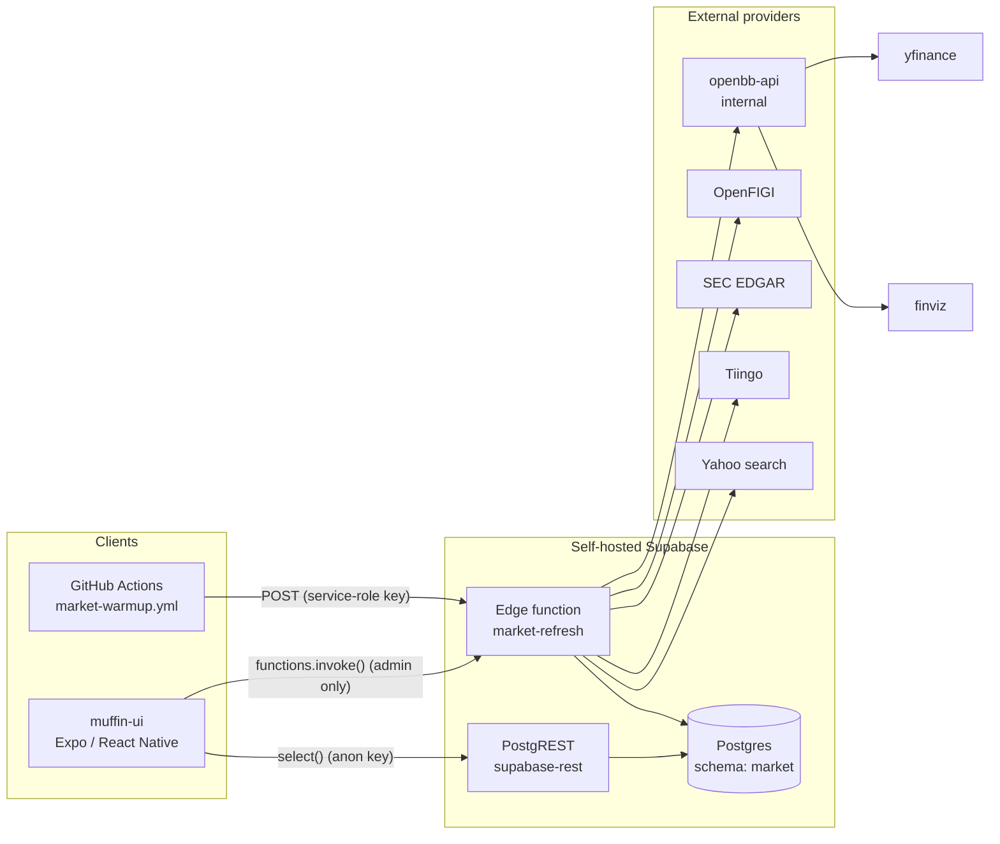
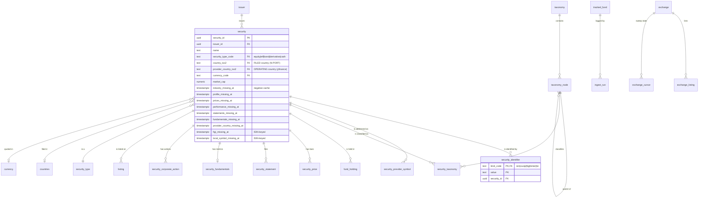
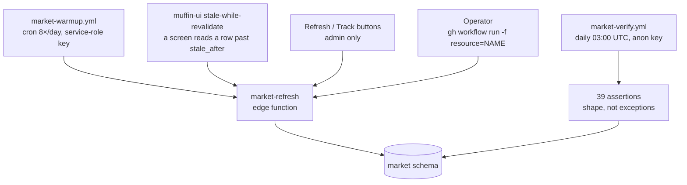
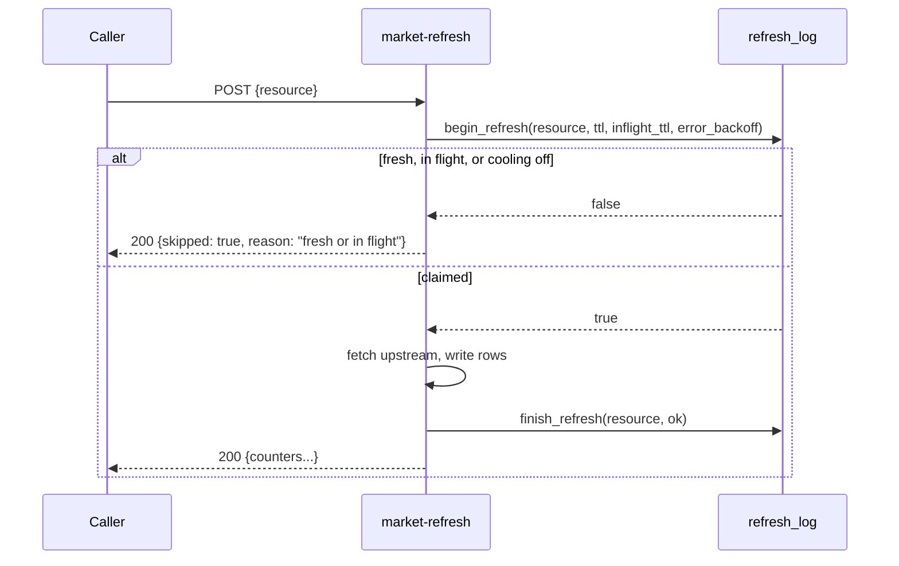
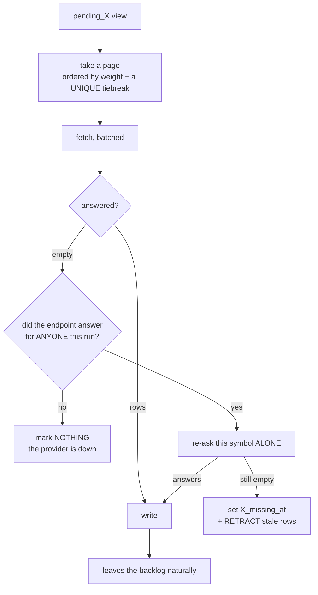

# Market data ingestion — how it works

**Status: current as of 2026-08-18.** Numbers are measured against production, not estimated.

This describes the whole ingestion pipeline: the data model, every external call, every scheduled
resource, where each field comes from, and what is missing. Coverage — what data we *have* versus
what we don't — is a separate document: [data-coverage.md](data-coverage.md).

---

## 1. The shape of the system

There is **no application server in the read path**. The app reads Postgres tables directly through
PostgREST; ingestion is a set of Deno edge functions that write to those tables on a schedule.



**Two consequences worth internalising.** Adding a read endpoint is adding a *table*, not writing
code. And a new table is **invisible over the API until PostgREST rebuilds its schema cache** — the
deploy sends `SIGUSR1` for this, because `notify pgrst, 'reload schema'` at the end of a migration
proved unreliable (15 tables once 404'd with `PGRST205` after two successful deploys).

---

## 2. Data model

### 2.1 Core entities



**`security_identifier` is the load-bearing table.** N-PORT identifies holdings by ISIN/CUSIP/LEI
and often carries **no ticker**; the app needs tickers; price data needs *provider* tickers. Nothing
joins without it. `PRIMARY KEY (kind_code, value)` is what makes resolution deterministic.

Resolution order is **ISIN → CUSIP → FIGI/other**, deliberately **not** LEI: an LEI identifies the
**issuer**, not the security, so GOOG and GOOGL share one and resolving on it merges distinct
securities silently.

### 2.2 Reference / control tables

These are **editable in Studio and survive redeploys** — that is the point of them.

| Table | What it controls | Upsert behaviour on redeploy |
|---|---|---|
| `tracked_fund` | Which ETFs we ingest N-PORT holdings from | `do nothing` — Studio edits win |
| `exchange` | Venue → country → provider suffix | source of truth for the sweep |
| `exchange_cursor` | Per-venue sweep position (type, prefix, cursor) | runtime state |
| `exchange_sweep_type` | Which instrument types to enumerate, and **which OpenFIGI field** each filters on | `do update` |
| `exchange_sweep_partition` | Ticker prefixes for venues over the paging ceiling | `do update` |
| `countries` | Drillable markets, region, tier | `do update` for display, `do nothing` for edits |
| `security_taxonomy` | Classification, **with `source_code`** so provider and filing coexist | `do nothing` |

### 2.3 Serving views (what the UI reads)

The app should never join five tables on a phone.

| View | Purpose | Note |
|---|---|---|
| `security_current` | security ⋈ preferred classification ⋈ primary symbol | **effective** country = `coalesce(provider, filed)` |
| `security_symbol` | the display symbol per security | decided by `listing.is_primary`, not "local always wins" |
| `sector_constituents` | securities in a sector, by fund weight | |
| `fund_sector_weight` / `fund_country_weight` | the Markets donut | restricted to **equity holdings + level-1 nodes** — see §8 |
| `security_statement_current` | latest statements | ~12 rows per security; **a row count reads as 12× coverage** |
| `untracked_listing` | directory rows not in the tracked universe | excludes on figi **or** provider_symbol **or** ticker |
| `pending_*` (9 views) | the backlogs that drive each resource | see §5 |

---

## 3. External providers — every call we make

| Provider | Reached via | Auth | Limit | Used by |
|---|---|---|---|---|
| **openbb-api** (internal service, same image as `openbb-mcp`) | `http://openbb-api:6900/api/v1/...` | none (private overlay) | provider-dependent | most resources |
| ↳ **yfinance** (through openbb) | keyless | — | throttles by **200-with-no-rows** | prices, performance, profiles, industries, fundamentals, statements |
| ↳ **finviz** (through openbb) | keyless | — | US-listed only | sector performance |
| **OpenFIGI** `/v3/mapping` | `api.openfigi.com/v3/mapping` | `OPENFIGI_API_KEY` | **250 req/min** keyed (25×10 anon) | ticker + local-symbol resolution |
| **OpenFIGI** `/v3/filter` | `api.openfigi.com/v3/filter` | `OPENFIGI_API_KEY` | **20 req/min** keyed — MEASURED, a separate bucket | exchange sweep |
| **SEC EDGAR** | `data.sec.gov`, `efts.sec.gov`, `www.sec.gov` | descriptive User-Agent (mandatory) | ~10 req/s fair access | fund holdings (N-PORT) |
| **Tiingo** | `api.tiingo.com/tiingo/daily/<sym>/prices` | `TIINGO_TOKEN` | hourly allocation, caps **unique symbols** | corporate actions |
| **Yahoo search** | `query2.finance.yahoo.com/v1/finance/search` | keyless | — | ISIN → home-market symbol |

### openbb routes actually used

```
equity/price/historical      daily bars (adjustment defaults to splits_only)
etf/historical               ETF daily bars, batched
equity/profile               sector, industry_category, hq_country, market cap
equity/fundamental/metrics   ~35 ratios, currency, a second market cap
equity/fundamental/income    income statement (one symbol at a time)
equity/fundamental/balance   balance sheet
equity/fundamental/cash      cash flow
equity/compare/groups        finviz sector performance (US only)
```

### Provider gotchas that cost real debugging

- **A throttled yfinance answers `200` with no rows**, not an error. Every outage rule was
  originally a *throw* check, which let ~8,300 securities be marked permanently unanswerable in one
  afternoon while every count stayed plausible.
- **OpenBB answers `204 No Content`** when a provider genuinely has nothing. That is an answer, not
  a fault.
- **OpenFIGI ignores an unknown filter key** and returns the venue **unfiltered** rather than
  erroring — a typo in a filter field floods rather than fails.
- **OpenFIGI stops paging at 15,000** while reporting the true total. Venues above it are swept in
  36 ticker-prefix partitions, triggered off the reported `total`, not a hardcoded list.
- **`/v3/filter` and `/v3/mapping` have DIFFERENT limits and separate buckets.** The widely-quoted
  "250 requests/minute with an API key" is `/v3/mapping`. `/v3/filter` was measured 2026-08-18 at
  **20/min keyed** — 20 consecutive 200s, first 429 on request 21. Sizing the sweep's budget
  against the mapping figure made it 7.5x too large, so it could never bind before the provider
  did. Verified separate: `/v3/mapping` returns 200 while `/v3/filter` is returning 429, so
  throttling the sweep does not affect ticker resolution.
- **FMP is unusable here**: v3 answers `403 Legacy Endpoint` (and openbb's provider calls v3); the
  `stable` line gates per symbol so hard that `ROST` and `TPR` return 402.
- **Symbols are not URL-safe.** `BRK/B` 400s its whole batch; `PE&OLES*.MX` **truncates the symbol
  list** and returns 200 for a short list with no error.

---

## 4. Triggers — who runs what, and when



- **Cron**: `market-warmup.yml`, **every 3 hours** (02:10, 05:10, … 23:10 UTC), **paced 30s between
  resources**. The pacing is load-bearing: firing everything back to back is what tripped yfinance's
  rate limit and caused the mass false-marking incident.
- **The app**: stale-while-revalidate. A screen reading a row past `stale_after` fires a background
  refresh; **the reader is never blocked**. Writes are admin-only (`app_metadata.role`, never
  `user_metadata`, which users can write themselves).
- **On demand**: `security-refresh` does returns, market cap, fundamentals **and statements** for one
  symbol — so a security someone actually opens is not last in a multi-week queue.
- **Manual**:
  ```bash
  gh workflow run market-warmup.yml -f resource=<name>
  # or, for force / fund scoping (service-role only):
  curl -X POST "$BASE/functions/v1/market-refresh" \
    -H "apikey: $SRV" -H "Authorization: Bearer $SRV" -H 'Content-Type: application/json' \
    -d '{"resource":"fund-holdings","fund":"XLE","force":true}'
  ```

**`force` bypasses the TTL and the error backoff but NOT the in-flight lock**, and is service-role
only — the anon key is public, and a public cache-buster is a free way to hammer a provider.

### The claim/release mutex

Every resource wraps its work in `begin_refresh` / `finish_refresh`:



**A 200 is not proof the work happened.** `skipped: true` is a 200 with no error, and so is
`{promoted: false}`. Fine for a background warm-up; wrong for an action a person took and is
watching — which is why the Track button requires `promoted === true`.

---

## 5. The resources

Seventeen on-demand/backlog resources plus four declarative ones. **Every resource declares its TTL
explicitly; there is no default** — a fallback default once left three resources on a 7-day TTL and
stopped price ingestion for three days while every signal said "healthy".

| Resource | TTL | Provider | Reads | Writes |
|---|---|---|---|---|
| `fund-holdings` | 30 d | SEC EDGAR | `tracked_fund` | `security`, `issuer`, `security_identifier`, `fund_holding`, `ingest_run` |
| `derive-classifications` | 30 d | — (pure SQL) | `fund_holding` | `security_taxonomy` |
| `exchange-listings` | 10 min | OpenFIGI | `exchange_cursor`, `exchange_sweep_type` | `exchange_listing` |
| `security-tickers` | 24 h | OpenFIGI | `pending_ticker` | `security_identifier` (ticker) |
| `security-local-symbols` | 10 min | OpenFIGI | `pending_local_symbol` | `security_provider_symbol`, `listing` |
| `security-yahoo-symbols` | 10 min | Yahoo search | `pending_yahoo_symbol` | `security_provider_symbol` |
| `security-profiles` | 10 min | yfinance | `pending_profile` | `security_taxonomy`, `security.market_cap`, `provider_country_iso2` |
| `security-industries` | 10 min | yfinance | `pending_industry` | `security_taxonomy` (level 2) |
| `security-fundamentals` | 10 min | yfinance | `pending_fundamentals` | `security_fundamentals`, `security.currency_code` |
| `security-statements` | 10 min | yfinance | `pending_statements` | `security_statement` |
| `security-prices` | 10 min | yfinance | `pending_prices` | `security_price` |
| `security-performance` | 10 min | yfinance | `pending_performance` | `performance` |
| `security-corporate-actions` | 10 min | Tiingo | `pending_corporate_actions` | `security_corporate_action` |
| `promote-listing` | 10 min | OpenFIGI | `exchange_listing` | `security` + identifiers |
| `security-refresh` | 10 min | yfinance | one symbol | performance, cap, fundamentals, statements |
| `instrument-prices` | 24 h | yfinance | `instruments` | `prices` |
| `instrument-profile` | 7 d | yfinance | `instruments` | `instruments` |
| `sector-` / `country-` / `group-` / `instrument-performance` | 24 h | finviz / yfinance | — | `performance` |

### The backlog pattern

Every incremental resource is driven by a `pending_*` view and follows the same rules, each of which
exists because it was got wrong at least once:



**Five rules encoded there, all learned the hard way:**

1. **A `pending_*` view must be an anti-join over the ENTITY**, not a `where … is null` over rows.
   A `where` filters rows, so one qualifying row cannot suppress another — `pending_industry` once
   re-queued every classified security forever while reporting progress.
2. **Every backlog needs a negative cache** (`X_missing_at`, 30 days). Without it, securities the
   provider can never answer for are re-asked forever and crowd out the ones that would resolve.
   Nine such columns exist; `market.symbol_cache_classification` records which a corrected symbol
   invalidates, and CI fails on any `%_missing_at` column nobody classified.
3. **A run-wide tally is never evidence about a symbol.** Marking requires the symbol to be asked
   **alone**. yfinance throttles *progressively* — omitting symbols from a 200 — so "some answered"
   proves nothing about the rest.
4. **Marking must retract.** A mark excludes the security from the backlog, so the code that stops
   *producing* a number can never *remove* the stale one. Securities served `1d = 0.00%` for four
   days that way.
5. **`remaining` counts SECURITIES.** Counting rows and subtracting from a count of securities
   clamps to zero, so a backlog thousands deep reports itself drained.

---

## 6. Field provenance — where each value comes from

| Field | Source | Notes |
|---|---|---|
| `security.name` | N-PORT filing, or OpenFIGI `/v3/mapping` | filings sometimes carry `New Issuer: BB Company ID:<n>`; OpenFIGI has the real name in a response we already make |
| `security.country_iso2` | N-PORT `invCountry` | the **incorporation/filing** country — Alibaba files as `KY` |
| `security.provider_country_iso2` | yfinance `equity/profile.hq_country` | the **operating** country — Alibaba is `CN`. Views expose `coalesce(provider, filed)` |
| `security.currency_code` | N-PORT `curCd`, then `equity/fundamental/metrics` | |
| `security.market_cap` | `equity/profile`, then promoted from `security_fundamentals.raw.market_cap` | in the security's **own currency** |
| `security.security_type_code` | N-PORT `assetCat` | a required field with a closed vocabulary; ignoring it once left 15,205 securities typed `other` |
| `security_identifier` | N-PORT `<isin>`, `<cusip>`, `<other>`; OpenFIGI for tickers | `<cusip>000000000</cusip>` is a **placeholder**, present on 72% of holdings |
| `security_provider_symbol` | OpenFIGI local symbol, or Yahoo search by ISIN | the fetch key; **not** necessarily the display symbol |
| `security_taxonomy` (sector) | filing (via fund) **and** yfinance, side by side | serving views pick with `distinct on … order by ds.priority` |
| `security_taxonomy` (industry) | `equity/profile.industry_category` | **not** `.industry`, which is present and always null |
| `security_price.close` | `equity/price/historical` | **already split-adjusted** (`adjustment` defaults to `splits_only`); dividends are **not** applied |
| `performance.*` | computed from daily bars | **price** returns, dividends excluded |
| `security_fundamentals.*` | `equity/fundamental/metrics` | **units are mixed within one response** — see §8 |
| `security_statement.data` | income/balance/cash, one jsonb per period | ~52 line items; no currency field, so the label comes from `security.currency_code` |
| `security_corporate_action` | Tiingo daily `divCash` / `splitFactor` | US-listed only; `observed_symbol` records the listing it was seen on |
| `fund_holding.weight` | N-PORT `pctVal` | **does not sum to 100** — EWT's own filing sums to 110.38 |
| `exchange_listing.security_type` | OpenFIGI `securityType2` (coarse) | an ETF reads `Mutual Fund` here |
| `exchange_listing.figi_security_type` | OpenFIGI `securityType` (fine) | the only one that says `ETP` |
| `countries.flag` / `region` / `tier` | derived: ISO-2 → regional indicators; World Bank; MSCI | **not authored** |

---

## 7. Guards and CI

Because almost every failure here has been **a success report with wrong data behind it**, the
guards check behaviour and shape rather than exceptions.

| Where | What |
|---|---|
| `quality.yml` → `migrations` | applies every migration **twice** against a throwaway Postgres, `--single-transaction` per file (mirrors production) |
| `quality.yml` → behaviour tests | 15 `.sql` tests; several seed the *production shape* then `\i` the real migration, because "applies to an empty database" proves nothing about a backfill |
| `quality.yml` → `functions` | `deno check` on `index.ts` **and** `logic-check.ts`, plus a network-free `logic-check.ts` run |
| `market-verify.yml` | daily, 39 assertions against production **as anon** — role matters: anon has a **3-second statement timeout** and `service_role` does not |
| `check_significant_holdings.py` | canary by **fund weight**, not market cap — a percentage is free of currency, cap and country |

**Guard discipline: a guard must be proven by deleting what it guards, and the mutation must be
verified to apply.** Two guards written *this week* passed while broken — one matched a string in a
neighbouring expression, one asserted a counter was incremented without asserting it was
incremented by the right quantity.

---

## 8. Traps worth reading before changing anything here

- **`PGRST_DB_MAX_ROWS` is 1000.** A `.limit(5000)` is not an error, just a shorter answer. Count with
  `Prefer: count=exact` + `Range: 0-0` and read `content-range`.
- **Anon has a 3-second statement timeout; `service_role` does not.** A slow view fails for the app
  while looking perfectly healthy to every service-role probe.
- **`create or replace view` can only APPEND columns** — not rename, reorder or drop. Drop first.
- **Migrations re-run on EVERY deploy**, so a data repair needs `market.one_shot`. Schema statements
  are idempotent by construction; repairs are not.
- **A bare 502 from an edge function means a dead worker** — look at memory or wall clock, not at
  error handling. Application failures answer **200 with `"ok": false`**.
- **Worker limits are ours**, not the platform's: 90s / 256MB in `functions/main/index.ts`. The real
  ceiling is Cloudflare cutting a proxied request at ~100s.
- **Units are mixed inside one provider response.** In `equity/fundamental/metrics`,
  `profit_margin` is a fraction, `dividend_yield` is already a percent, and `dividend_yield_5y_avg`
  is a fraction again. One shared `pct()` rendered NVIDIA at a 46% dividend yield.
- **Money must carry its currency**, and the symbol comes from `Intl` with a **pinned locale**.
  A hardcoded `$` rendered Alibaba's CNY revenue as "$1.02T".
- **A discontinuity in a price series is not a market move** — but it is usually **not a split**
  either, since bars arrive split-adjusted. Tel Aviv's shekel→agorot redenomination and OTC ratio
  changes are the real causes, and no splits feed fixes them.

---

## 9. Adding things

**Add an ETF** (no deploy): insert a row in `market.tracked_fund` in Studio, then
`fund-holdings` (scoped) → `derive-classifications`. Everything downstream — symbols, sectors,
industries, prices, fundamentals — picks it up from the backlogs on its own.

**Add a venue** (no deploy): a row in `market.exchange`. Derive `exch_code` from OpenFIGI
`/v3/mapping` on an ISIN you already hold, and the provider suffix from Yahoo search on the ticker
it returns. **The two differ and that is the trap** — Doha is `QD` to OpenFIGI and `.QA` to Yahoo.
A wrong suffix does not error; it produces a symbol the provider answers nothing for, which is then
negative-cached.

**Add an instrument type to the sweep** (no deploy): a row in `market.exchange_sweep_type`,
including `figi_field` — `securityType2` for stocks and receipts, `securityType` for `ETP`.

**Add a new resource** (deploy): a handler in `index.ts`, an entry in `EXTRA_TTL_MINUTES` (there is
no default — omitting it makes the resource `unknown`), a name in `market-warmup.yml`, and a
`pending_*` view with a negative cache. `logic-check.ts` enforces all of these.

---

## 9b. Measured freshness — what the TTLs actually achieve

`stale_after` is a REQUEST, not a guarantee, and the gap is worth knowing before reading it as one.
Measured 2026-08-18 across 81,474 `performance` rows:

| age | share |
|---|---|
| older than 1 day | 52.0% |
| older than 3 days | 46.5% |
| older than 7 days | **0.2%** |
| older than 14 days | **0** |

So the full cycle completes in about a week and nothing is older than 8 days, while every row
declares a **24-hour** TTL. The difference is throughput: `security-performance` covers ~360–640
securities per run against ~12,350 equities, and the binding constraint is the provider's rate
limit rather than the schedule.

**Every period carries the SAME 24h TTL**, so a `1d` return can be three days old — it is the daily
move *as of* its `as_of`, not as of now. That is disclosed rather than hidden: the UI's `Freshness`
component renders the true age (`"3d ago · yfinance"`) beside the number.

It is deliberately not "fixed" by refreshing short periods more often. One fetch produces every
period from the same series, so splitting them by period would multiply provider calls — against the
one constraint that actually binds — to buy freshness on the periods that matter least in a system
whose charts are already drawn from `security_price`.

Prices themselves are current: spot-checked across AAPL, 7203.T, 005930.KS, NESN.SW, BHP.AX and
PETR4.SA, the newest bar is the last trading day in every market.

## 10. Known gaps in the *pipeline*

For gaps in the *data*, see [data-coverage.md](data-coverage.md).

- **Total return is not computed.** Bars are split-adjusted but not dividend-adjusted. Two routes
  exist and the cheaper one is unmeasured: `include_actions` may return dividends as columns on the
  price response we already fetch.
- **Corporate actions are US-only** (Tiingo 404s local foreign listings), so a Japanese split is
  invisible.
- **`security-performance` runs at ~89s of its 90s worker limit.** Its deadline gates whether to
  *start* a batch while that batch's tail is unbounded. It has been killed once.
- **A deploy briefly breaks readers.** Migrations are `--single-transaction` *per file*, so between
  the file that drops dependent views and the one that recreates them there is a real window where a
  reader 404s.
- **The reporting currency of statements is unknown**, so the label is withheld rather than guessed.
  Five sources were checked and none supplies it.
