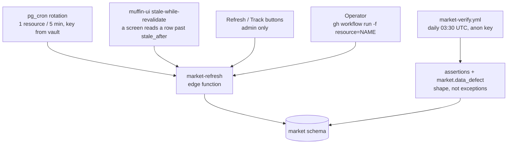
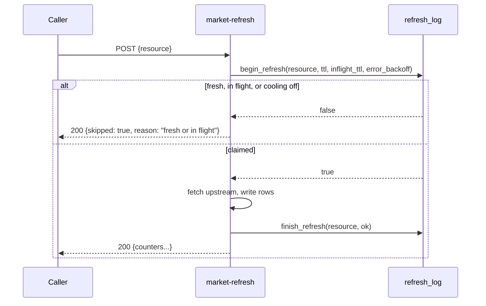
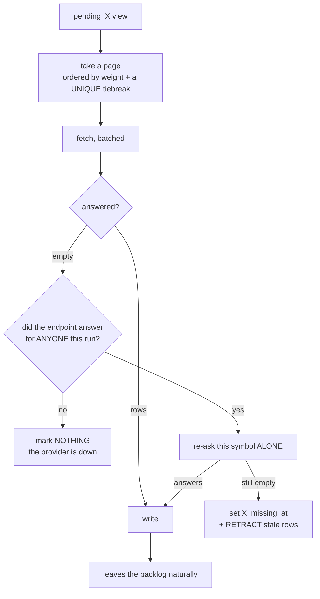

# Market data ingestion — how it works

**Status: current as of 2026-08-28.** Numbers are measured against production, not estimated.

> **Changed 2026-08-27:** the scheduler moved out of GitHub Actions into **pg_cron** (§4).
> `market-warmup.yml` no longer exists; `market.cron_resource` is the source of truth for what runs.

This describes the whole ingestion pipeline: the data model, every external call, every scheduled
resource, where each field comes from, and what is missing. Coverage — what data we *have* versus
what we don't — is a separate document: [data-coverage.md](data-coverage.md).

---

## 1. The shape of the system

There is **no application server in the read path**. The app reads Postgres tables directly through
PostgREST; ingestion is a set of Deno edge functions that write to those tables on a schedule.

```mermaid
flowchart LR
    subgraph clients[Clients]
      UI[muffin-ui<br/>Expo / React Native]
      CRON[pg_cron<br/>market.cron_tick&#40;&#41; every 5 min]
    end

    subgraph supabase[Self-hosted Supabase]
      REST[PostgREST<br/>supabase-rest]
      FN[Edge function<br/>market-refresh]
      PG[(Postgres<br/>schema: market)]
    end

    subgraph providers[External providers]
      OBB[openbb-api<br/>internal]
      FIGI[OpenFIGI]
      SEC[SEC EDGAR]
      TII[Tiingo]
      YAH[Yahoo search]
    end

    UI -- "select() (anon key)" --> REST
    UI -- "functions.invoke() (admin only)" --> FN
    CRON -- "POST (service-role key, from vault)" --> FN
    REST --> PG
    FN --> PG
    FN --> OBB
    FN --> FIGI
    FN --> SEC
    FN --> TII
    FN --> YAH
    OBB --> YF[yfinance]
    OBB --> FV[finviz]
```



**Two consequences worth internalising.** Adding a read endpoint is adding a *table*, not writing
code. And a new table is **invisible over the API until PostgREST rebuilds its schema cache** — the
deploy sends `SIGUSR1` for this, because `notify pgrst, 'reload schema'` at the end of a migration
proved unreliable (15 tables once 404'd with `PGRST205` after two successful deploys).

---

## 2. Data model

### 2.1 Core entities

```mermaid
erDiagram
    issuer ||--o{ security : "issues"
    security ||--o{ security_identifier : "is identified by"
    security ||--o{ security_provider_symbol : "is addressed as"
    security ||--o{ security_taxonomy : "is classified as"
    security ||--o{ fund_holding : "is held in"
    security ||--o{ security_price : "has bars"
    security ||--o{ security_statement : "files"
    security ||--o| security_fundamentals : "has metrics"
    security ||--o{ security_metric : "metric history"
    metric   ||--o{ security_metric : "catalogue"
    metric   ||--o{ metric_source_field : "provider spelling"
    metric   ||--o{ xbrl_concept : "XBRL concepts, per taxonomy"
    security ||--o{ security_share_stats : "float, ownership, short interest"
    security ||--o{ security_estimate : "analyst consensus"
    security ||--o{ news_security : "articles"
    news_article ||--o{ news_security : "shared between securities"
    security ||--o{ security_corporate_action : "has actions"
    security ||--o{ listing : "is listed on"
    security }o--|| security_type : "is a"
    security }o--o| countries : "filed in"
    security }o--o| currency : "quoted in"
    taxonomy ||--o{ taxonomy_node : "contains"
    taxonomy_node ||--o{ taxonomy_node : "parent of"
    taxonomy_node ||--o{ security_taxonomy : "classifies"
    tracked_fund ||--o{ ingest_run : "logged by"
    exchange ||--o{ exchange_listing : "lists"
    exchange ||--o{ exchange_cursor : "sweep state"

    security {
        uuid security_id PK
        uuid issuer_id FK
        text name
        text security_type_code FK "equity|etf|bond|derivative|cash"
        text country_iso2 FK "FILED country (N-PORT)"
        text provider_country_iso2 FK "OPERATING country (yfinance)"
        text currency_code FK
        numeric market_cap
        timestamptz industry_missing_at "negative cache"
        timestamptz profile_missing_at
        timestamptz prices_missing_at
        timestamptz performance_missing_at
        timestamptz statements_missing_at
        timestamptz fundamentals_missing_at
        timestamptz provider_country_missing_at
        timestamptz figi_missing_at "ISIN-keyed"
        timestamptz local_symbol_missing_at "ISIN-keyed"
    }
    security_identifier {
        text kind_code PK,FK "isin|cusip|figi|ticker|lei"
        text value PK
        uuid security_id FK
    }
```



**`security_identifier` is the load-bearing table.** N-PORT identifies holdings by ISIN/CUSIP/LEI
and often carries **no ticker**; the app needs tickers; price data needs *provider* tickers. Nothing
joins without it. `PRIMARY KEY (kind_code, value)` is what makes resolution deterministic.

Resolution order is **ISIN → CUSIP → FIGI/other**, deliberately **not** LEI: an LEI identifies the
**issuer**, not the security, so GOOG and GOOGL share one and resolving on it merges distinct
securities silently.

### 2.2 Reference / control tables

These are **editable in Studio and survive redeploys** — that is the point of them.

| Table | What it controls | Upsert behaviour on redeploy |
|---|---|---|
| `tracked_fund` | Which ETFs we ingest N-PORT holdings from | `do nothing` — Studio edits win |
| `exchange` | Venue → country → provider suffix | source of truth for the sweep |
| `exchange_cursor` | Per-venue sweep position (type, prefix, cursor) | runtime state |
| `exchange_sweep_type` | Which instrument types to enumerate, and **which OpenFIGI field** each filters on | `do update` |
| `exchange_sweep_partition` | Ticker prefixes for venues over the paging ceiling | `do update` |
| `countries` | Drillable markets, region, tier | `do update` for display, `do nothing` for edits |
| `security_taxonomy` | Classification, **with `source_code`** so provider and filing coexist | `do nothing` |

### 2.3 Serving views (what the UI reads)

The app should never join five tables on a phone.

| View | Purpose | Note |
|---|---|---|
| `security_current` | security ⋈ preferred classification ⋈ primary symbol | **effective** country = `coalesce(provider, filed)` |
| `security_symbol` | the display symbol per security | decided by `listing.is_primary`, not "local always wins" |
| `sector_constituents` | securities in a sector, by fund weight | |
| `fund_sector_weight` / `fund_country_weight` | the Markets donut | restricted to **equity holdings + level-1 nodes** — see §8 |
| `security_statement_current` | latest statements | ~12 rows per security; **a row count reads as 12× coverage** |
| `untracked_listing` | directory rows not in the tracked universe | excludes on figi **or** provider_symbol **or** ticker |
| `pending_promotion` | listings eligible for promotion | opt-in per venue, home markets first, **name-deduped** against what we hold |
| **`security_facets`** | the filter spine — every dimension a list filters by | **MATERIALIZED**, 15 indexes. As a plain view a two-filter conjunction hit anon's 3s timeout (`57014`); see §8 |
| **`symbol_security`** | symbol → security_id | **MATERIALIZED**, indexed on the symbol. `security_symbol` is a view over two LATERAL subqueries, so resolving ONE symbol through it scans all 27,629 securities — measured, that was most of a daily chart's 260 ms and 1,382 ms of a weekly one, which timed out for anon. Refreshed by `facets-refresh` alongside the spine |
| **`security_metric_series`** | metric history with the symbol — what the charts and statement tables read | **ONE ROW PER FISCAL PERIOD.** Rows for the same (security, metric, period_type) whose period ends fall within 7 days are one period reported by two sources; the highest-priority source wins, which also picks the true fiscal period end. See §8 |
| `security_style` | growth/value, ranked within a (tier × cap band) cohort | a plain view — a pure function of `security_fundamentals`, with nothing extra to keep fresh |
| `macro_current` | latest value per macro series, unit-converted | the fraction→percent conversion lives HERE so no reader has to know which provider sent which |
| **`security_segment_spine`** | every business line, for anything that scans more than one security | **MATERIALIZED**, refreshed hourly. `select *` over `security_segment_current`, so the two cannot drift in definition. The live view is 3.8 ms for one security and **6.1 s for all of them**; a stock page reads the view, an aggregate reads this |
| `security_segment_geography` | where a company earns | published members only (ISO countries + standard regions), so **no curation was involved**. A filer's own region extension is absent until it has a `segment_member` row |
| `pending_*` (9 views) | the backlogs that drive each resource | see §5 |

---

## 3. External providers — every call we make

| Provider | Reached via | Auth | Limit | Used by |
|---|---|---|---|---|
| **openbb-api** (internal service, same image as `openbb-mcp`) | `http://openbb-api:6900/api/v1/...` | none (private overlay) | provider-dependent | most resources |
| ↳ **yfinance** (through openbb) | keyless | — | throttles by **200-with-no-rows** | prices, performance, profiles, industries, fundamentals, statements |
| ↳ **finviz** (through openbb) | keyless | — | US-listed only | sector performance |
| **OpenFIGI** `/v3/mapping` | `api.openfigi.com/v3/mapping` | `OPENFIGI_API_KEY` | **250 req/min** keyed (25×10 anon) | ticker + local-symbol resolution |
| **OpenFIGI** `/v3/filter` | `api.openfigi.com/v3/filter` | `OPENFIGI_API_KEY` | **20 req/min** keyed — MEASURED, a separate bucket | exchange sweep |
| **SEC EDGAR** | `data.sec.gov`, `efts.sec.gov`, `www.sec.gov` | descriptive User-Agent (mandatory) | ~10 req/s fair access | fund holdings (N-PORT) |
| **Tiingo** | `api.tiingo.com/tiingo/daily/<sym>/prices` | `TIINGO_TOKEN` | hourly allocation, caps **unique symbols** | corporate actions |
| **Yahoo search** | `query2.finance.yahoo.com/v1/finance/search` | keyless | — | ISIN → home-market symbol |
| ↳ **FRED** (through openbb) | `FRED_API_KEY` (already configured) | — | international macro by explicit series id | `macro-indicators` |
| ↳ **OECD / federal_reserve** (through openbb) | keyless | — | CPI, GDP, unemployment, yield curve, EFFR, SOFR | `macro-indicators` |

### Every one of those goes through the cache first (2026-08-25)

**The "Reached via" column above is the ORIGIN, not the address the code dials.** Since
`http-cache` shipped, every provider is reached through an OpenResty read-through cache on the
overlay, and the callers only know a base URL — `origins.ts` for the direct providers,
`OPENBB_API_URL`, `OPENBB_MCP_URL`. No cache logic exists in any caller.

| Location | Origin | TTL (200s only) |
|---|---|---|
| `/sec/` | `www.sec.gov` | 30d |
| `/sec-data/` | `data.sec.gov` | 7d |
| `/sec-fts/` | `efts.sec.gov` | 7d |
| `/openfigi/` | `api.openfigi.com` | 90d |
| `/yahoo/v1/finance/search` | `query2.finance.yahoo.com` | 30d |
| `/yahoo/` | `query2.finance.yahoo.com` | 1h |
| `/alphavantage/` | `www.alphavantage.co` | 30d |
| `/tiingo/` | `api.tiingo.com` | 7d |
| `/openbb/` | `openbb-api:6900` | 1h |
| `/mcp/` | `openbb-mcp:8001` | 1h |

**Key recipe v1** — `"$request_method|$proxy_host|$request_uri|$body_key"`, where `$body_key` is an
**MD5 computed in Lua**, not `$request_body`. That is not a stylistic choice: `$request_body` is
EMPTY once a body spills past `client_body_buffer_size`, and because the key *contains* the body it
can also overflow `proxy_buffer_size`, at which point nginx logs an error and **silently stops
caching**. Both were measured; see §8.

Three more facts worth knowing before you change anything here:

- **`inactive=365d` is load-bearing.** nginx evicts by **last access**, not by TTL, and the default
  is **10 minutes** — without it a `proxy_cache_valid 30d` caches nothing while looking correct.
- **Only 200s are cached.** A cached 429 or 5xx would be poison. Conversely
  `proxy_cache_use_stale ... http_429` deliberately serves the last GOOD entry when a provider
  starts throttling.
- **`X-Cache-Status` is on every response** (`HIT`/`MISS`/`EXPIRED`/`STALE`/`UPDATING`/`BYPASS`).
  That header, not the proxy's own counters, is what any verification should read.

**The bypass** is `http_cache_enabled: false` (GitHub variable `HTTP_CACHE_ENABLED`), which points
every caller back at the real origin without editing the stack. Every default in `origins.ts` is
the real origin, so removing the cache service cannot take ingestion down.

### openbb routes actually used

```
equity/price/historical      daily bars (adjustment defaults to splits_only)
etf/historical               ETF daily bars, batched
equity/profile               sector, industry_category, hq_country, market cap
equity/fundamental/metrics   ~35 ratios, currency, a second market cap
equity/fundamental/income    income statement (one symbol at a time)
equity/fundamental/balance   balance sheet
equity/fundamental/cash      cash flow
equity/compare/groups        finviz sector performance (US only)
```

### Provider gotchas that cost real debugging

- **A throttled yfinance answers `200` with no rows**, not an error. Every outage rule was
  originally a *throw* check, which let ~8,300 securities be marked permanently unanswerable in one
  afternoon while every count stayed plausible.
- **OpenBB answers `204 No Content`** when a provider genuinely has nothing. That is an answer, not
  a fault.
- **OpenFIGI ignores an unknown filter key** and returns the venue **unfiltered** rather than
  erroring — a typo in a filter field floods rather than fails.
- **OpenFIGI stops paging at 15,000** while reporting the true total. Venues above it are swept in
  36 ticker-prefix partitions, triggered off the reported `total`, not a hardcoded list.
- **`/v3/filter` and `/v3/mapping` have DIFFERENT limits and separate buckets.** The widely-quoted
  "250 requests/minute with an API key" is `/v3/mapping`. `/v3/filter` was measured 2026-08-18 at
  **20/min keyed** — 20 consecutive 200s, first 429 on request 21. Sizing the sweep's budget
  against the mapping figure made it 7.5x too large, so it could never bind before the provider
  did. Verified separate: `/v3/mapping` returns 200 while `/v3/filter` is returning 429, so
  throttling the sweep does not affect ticker resolution.
- **FMP is unusable here**: v3 answers `403 Legacy Endpoint` (and openbb's provider calls v3); the
  `stable` line gates per symbol so hard that `ROST` and `TPR` return 402.
- **Symbols are not URL-safe.** `BRK/B` 400s its whole batch; `PE&OLES*.MX` **truncates the symbol
  list** and returns 200 for a short list with no error.

---

## 4. Triggers — who runs what, and when



- **Cron**: a **pg_cron ROTATION inside the database** (migration 133), not a GitHub workflow.
  `market.cron_tick()` fires **every 5 minutes** and posts the NEXT resource from
  `market.cron_resource`, so 38 resources make a full sweep every **3.2 hours** — about the same
  per-resource cadence as the 8×/day workflow it replaces (7.6 turns/day vs 8), with gentler
  spacing. **The pacing is load-bearing and the rotation cannot burst by construction**: firing
  everything back to back is what tripped yfinance's rate limit and caused the mass false-marking
  incident. A missed firing now delays the rotation by five minutes rather than losing a sweep.

  It moved because GitHub was not honouring the schedule — measured over four days, **19 runs
  against 32 expected**, every one 19–127 minutes late, with gaps up to **13.3 hours** against a
  nominal 3. That exceeded the 12-hour "resource has stopped succeeding" alert, so the scheduler's
  own flakiness would eventually have fired our alarm.

  **`observability-sample` is NOT in the rotation** — it touches no external provider, so it is
  free to run often, and its rate is what decides whether a dashboard draws a line or a single dot.
  It has its own hourly job.

  **The credentials live in `vault.secrets`**, written by Ansible and read by `market.cron_post()`.
  If they are absent the tick returns a reason and posts **nothing**, rather than firing 288
  unauthenticated requests a day — a deliberate loud no-op, and one that kept the pipeline stopped
  for hours when the Ansible task that writes them failed. Nothing alerts on it yet beyond the
  scheduler-silent rule; `cron.job_run_details` records `succeeded` because the tick did.
- **The app**: stale-while-revalidate. A screen reading a row past `stale_after` fires a background
  refresh; **the reader is never blocked**. Writes are admin-only (`app_metadata.role`, never
  `user_metadata`, which users can write themselves).
- **On demand**: `security-refresh` does returns, market cap, fundamentals **and statements** for one
  symbol — so a security someone actually opens is not last in a multi-week queue.
- **Manual** (the `gh workflow run market-warmup.yml` recipe is GONE — that workflow was deleted
  when the scheduler moved into the database):
  ```bash
  # drive one resource now, from the node:
  #   select market.cron_post('security-statements');
  # or over HTTP — for force / fund scoping (service-role only):
  curl -X POST "$BASE/functions/v1/market-refresh" \
    -H "apikey: $SRV" -H "Authorization: Bearer $SRV" -H 'Content-Type: application/json' \
    -d '{"resource":"fund-holdings","fund":"XLE","force":true}'
  ```

**`force` bypasses the TTL and the error backoff but NOT the in-flight lock**, and is service-role
only — the anon key is public, and a public cache-buster is a free way to hammer a provider.

### The claim/release mutex

Every resource wraps its work in `begin_refresh` / `finish_refresh`:



**A 200 is not proof the work happened.** `skipped: true` is a 200 with no error, and so is
`{promoted: false}`. Fine for a background warm-up; wrong for an action a person took and is
watching — which is why the Track button requires `promoted === true`.

---

## 5. The resources

Twenty on-demand/backlog resources plus four declarative ones. **Every resource declares its TTL
explicitly; there is no default** — a fallback default once left three resources on a 7-day TTL and
stopped price ingestion for three days while every signal said "healthy".

| Resource | TTL | Provider | Reads | Writes |
|---|---|---|---|---|
| `fund-holdings` | 30 d | SEC EDGAR | `tracked_fund` | `security`, `issuer`, `security_identifier`, `fund_holding`, `ingest_run` |
| `derive-classifications` | 30 d | — (pure SQL) | `fund_holding` | `security_taxonomy` |
| `exchange-listings` | 10 min | OpenFIGI | `exchange_cursor`, `exchange_sweep_type` | `exchange_listing` |
| `security-tickers` | 24 h | OpenFIGI | `pending_ticker` | `security_identifier` (ticker) |
| `security-local-symbols` | 10 min | OpenFIGI | `pending_local_symbol` | `security_provider_symbol`, `listing` |
| `security-yahoo-symbols` | 10 min | Yahoo search | `pending_yahoo_symbol` | `security_provider_symbol` |
| `security-profiles` | 10 min | yfinance | `pending_profile` | `security_taxonomy`, `security.market_cap`, `provider_country_iso2` |
| `security-industries` | 10 min | yfinance | `pending_industry` | `security_taxonomy` (level 2) |
| `security-fundamentals` | 10 min | yfinance | `pending_fundamentals` | `security_fundamentals`, `security.currency_code` |
| `security-statements` | 10 min | **sec**, yfinance fallback | `pending_statements` | `security_statement` (+ `currency`, `period_type`) |
| `security-metrics` | 10 min | **none — SQL only** | `pending_metrics` (a drift counter, not a queue) | `security_metric` |
| `sec-cik-map` | 30 days | SEC `company_tickers.json` | — (one file, applied in one statement) | `security.cik` |
| `security-xbrl` | 10 min | **SEC XBRL direct**, not openbb | `pending_xbrl` | `security_metric` (`sec-xbrl`) |
| **`security-segments`** | 10 min | **SEC filing XBRL instance**, not the API | `pending_segments` — **breadth-first**, see below | `security_segment` — revenue, operating income, capex, depreciation, cost of revenue and assets PER BUSINESS LINE |
| **`security-filing-history`** | 10 min | SEC submissions API | `pending_filing_history` | `security_filing` (full history) + `security.sic` + `filer_profile` + `security_former_name` |
| `security-price-history` | 10 min | yfinance `interval=1W` | `pending_price_history` | `security_price` (`grain = 'weekly'`) |
| **`security-daily-history`** | 10 min | yfinance `interval=1d`, `start_date=1970-01-01` | `pending_daily_history` | `security_price` (`grain = 'daily'`) — **20+ years**, whole universe |
| **`earnings-history`** | 10 min | nasdaq `calendar/earnings`, walked BACKWARD | `earnings_history_cursor` | `security_eps_history` (`source_code = 'nasdaq'`) |
| `security-share-stats` | 10 min | yfinance | `pending_share_stats` (drives BOTH endpoints) | `security_share_stats`, `security_estimate` |
| `security-news` | 10 min | yfinance | `pending_news` | `news_article`, `news_security` |
| `security-symbol-repair` | 10 min | yfinance (one probe per candidate) | `pending_symbol_repair` | `security_provider_symbol` |
| `security-dividends` | 10 min | yfinance | `pending_dividends` | `security_corporate_action` |
| `fx-rates` | 1 day | yfinance | — | `fx_rate` |
| `security-prices` | 10 min | yfinance | `pending_prices` | `security_price` |
| `security-performance` | 10 min | yfinance | `pending_performance` | `performance` |
| `security-corporate-actions` | 10 min | Tiingo | `pending_corporate_actions` | `security_corporate_action` |
| `promote-listing` | 10 min | OpenFIGI | `exchange_listing` | `security` + identifiers |
| `promote-wave` | 10 min | — (pure SQL) | `pending_promotion` | `security` + identifiers, **≤100/run** |
| `macro-indicators` | 6 h | openbb (oecd/fed/fred/yfinance) | `macro_indicator` | `macro_observation` |
| `facets-refresh` | 60 min | — (pure SQL) | — | refreshes `symbol_security` **and** `security_facets` concurrently, then calls `refresh_segment_spine()` as a **second RPC** — one statement cannot hold all three under the role's 8 s timeout |
| `security-refresh` | 10 min | yfinance | one symbol | performance, cap, fundamentals, statements |
| `instrument-prices` | 24 h | yfinance | `instruments` | `prices` |
| `instrument-profile` | 7 d | yfinance | `instruments` | `instruments` |
| `sector-` / `country-` / `group-` / `instrument-performance` | 24 h | finviz / yfinance | — | `performance` |

### The backlog pattern

Every incremental resource is driven by a `pending_*` view and follows the same rules, each of which
exists because it was got wrong at least once:



**Five rules encoded there, all learned the hard way:**

1. **A `pending_*` view must be an anti-join over the ENTITY**, not a `where … is null` over rows.
   A `where` filters rows, so one qualifying row cannot suppress another — `pending_industry` once
   re-queued every classified security forever while reporting progress.
2. **Every backlog needs a negative cache** (`X_missing_at`, 30 days). Without it, securities the
   provider can never answer for are re-asked forever and crowd out the ones that would resolve.
   Nine such columns exist; `market.symbol_cache_classification` records which a corrected symbol
   invalidates, and CI fails on any `%_missing_at` column nobody classified.
3. **A run-wide tally is never evidence about a symbol.** Marking requires the symbol to be asked
   **alone**. yfinance throttles *progressively* — omitting symbols from a 200 — so "some answered"
   proves nothing about the rest.
4. **Marking must retract.** A mark excludes the security from the backlog, so the code that stops
   *producing* a number can never *remove* the stale one. Securities served `1d = 0.00%` for four
   days that way.
5. **`remaining` counts SECURITIES.** Counting rows and subtracting from a count of securities
   clamps to zero, so a backlog thousands deep reports itself drained.
6. **A backlog ordered by a property of the ENTITY is depth-first, and that is invisible.**
   `pending_segments` ranked by fund weight, which every filing of a company shares — so the
   accession tiebreak walked one filer's entire history and 440 parsed filings belonged to
   **14 securities**. Every counter said healthy because the rows were correct; they were the
   wrong rows first. Where breadth matters, rank by a per-entity `row_number()` **first** and the
   entity's importance second.
7. **Every backlog needs a row in `market.backlog_negative_cache`.** It is what lets
   `backlog_drain` tell a queue that drained by WORKING from one that drained by MARKING — the
   2026-08-13 signature, where a backlog reached zero while ~8,300 securities were negative-cached
   and the depth curve looked identical to health. A backlog with no row still gets a depth and a
   slope and silently loses that discrimination. **Six are still unclassified** (`pending_news`,
   `pending_insider`, `pending_filings`, `pending_management`, `pending_eps_history`,
   `pending_fx_history`) — deliberately not guessed at, because naming the wrong column asserts a
   pairing that does not hold, which is worse than the absence. Nothing enforces this yet; a CI
   guard over `pg_class` would.

---

### Business lines (added 2026-08-29)

`security-segments` reads **each filing's own XBRL instance** — not the XBRL REST API, which
**strips dimensions**: `companyconcept` for AAPL revenue returns one value per period
($416.16bn for FY2025) with no iPhone in it. The instance keeps them and is small enough to read in
a worker (measured: AAPL 10-Q **0.74 MB**, AMZN 10-K 1.98 MB, Diageo's 20-F **10.92 MB** — which
still downloads in 0.37 s and parses in 40 ms at 15 MB of heap).

SEC's quarterly **bulk datasets** carry the same `segments` column back to 2015q1 and are how every
expected value in the tests was first proven — but at 122 MB zipped / **542 MB** unpacked they need
a second scheduler or a second executor, which this pipeline deliberately does not have. Do not
re-propose them.

```mermaid
flowchart LR
  F[security_filing<br/>30,072 accounts filings] --> P[pending_segments]
  P --> D[index.json<br/>→ HTML index fallback]
  D --> I[the XBRL instance]
  I --> S[segment facts<br/>+ partition_id]
  S --> C[derive_segment_classification&#40;&#41;<br/>weighted security_taxonomy rows]
```



**THE ONE THING TO KNOW BEFORE READING `security_segment`.** An axis can carry SEVERAL OVERLAPPING
SPLITS that each sum to the consolidated total. Measured on Amazon's FY2025 10-K: the
`ProductOrService` axis holds a seven-line split summing to **716,924,000,000** *and* a
Product/Service split summing to the same, while `StatementBusinessSegments` holds a three-line
split summing to it again — and AWS appears under two axes with two different values.
`sum(value)` over an axis **doubles** the company's revenue; over the table it **triples** it,
silently and in the right units. Hence `partition_id`: **aggregate within one partition or not at
all**, and never aggregate partition 0 (a subtotal such as Apple's `ProductMember`, which is the
sum of iPhone/iPad/Mac/Wearables). `security_segment_current` serves partition 1 only.

Four more things that are easy to get wrong here, each measured:

- **The axis name is DATA, not code.** us-gaap says `srt:ProductOrServiceAxis`, ifrs-full says
  `ifrs-full:ProductsAndServicesAxis`; Diageo's 20-F parses to Spirits/Beer/Ready-to-Drink through
  the second. `market.segment_axis` is the allowlist, so a taxonomy is rows. An allowlist is
  mandatory rather than tidy — Apple's instance carries 206 dimensioned facts of which only 44 are
  segmentations, the rest being fair-value levels and equity components.
- **Segment PROFIT does not reconcile, by design.** ASC 280 and IFRS 8 require a *reconciliation*,
  not an identity: Apple's segment operating income sums to ~38.9bn against a consolidated ~28.2bn
  because shared costs are unallocated. So the split is learned from **revenue** and applied to
  profit; a rule demanding every metric reconcile marks all profit unusable, which is the number
  the feature exists to serve.
- **`index.json` is not reliable.** Diageo's and Infosys's 20-F directories report **4 items** while
  the HTML index lists the full set including the instance — so trusting it concludes "no XBRL" for
  exactly the foreign private issuers this reaches. There is an HTML fallback.
- **A cursor, not a negative cache.** `security_filing.segments_parsed_at` records that we LOOKED,
  permanently, because a filed document is immutable. Re-reading is driven by
  `market.segment_parser.version` — bump it and every filing re-queues, no deploy.

**SIX METRICS, NOT TWO, AND FIVE OF THEM COST NOTHING.** The instance carries more than revenue.
Measured on Amazon's 10-Q, the facts dimensioned by a segment axis are revenue (48),
`SegmentExpenditureAdditionToLongLivedAssets` (20), `CostsAndExpenses` (12), `OperatingIncomeLoss`
(12), `Depreciation` (12) and `Assets` (6) — so capex, depreciation, cost of revenue and assets are
already on the wire. Live: **AWS assets 194,295,000,000, capex 16,043,000,000/quarter,
depreciation 4,844,000,000/quarter**, which is return on segment assets and a capex-to-depreciation
ratio per business line.

**`Assets` IS AN INSTANT, AND THAT IS NOT A DETAIL.** A stock measured *at* a date, not a flow over
one — and segment assets **never reconcile** to consolidated assets, because corporate assets and
eliminations sit outside the segments exactly as unallocated cost does for profit. So no instant
bucket can earn a partition on its own. The split is **learned** per (metric, period type, span) and
**applied** per (axis, period end); an instant at a date with no duration bucket stays unplaced.

`security-filing-history` exists because **the filing index was shallow by a `limit=40`**, not
because SEC is: `security_filing` held 8,450 accounts filings for 2026 and **four** for 2015, and
segment depth is exactly filing depth. SEC's submissions API returns the complete history in one
keyless request (Amazon: 114 accounts filings back to **1997**) — **and carries `sic` in the same
payload**, so the SIC classification costs no request of its own. It also states `isXBRL` per
filing, which is what stops the segment resource spending two requests on a 1998 filing to discover
there is nothing to read.

**AND THE SAME RESPONSE CARRIES THE REGISTRANT'S OWN TICKER.** `market.filer_profile` stores what
the company told SEC — `AAPL / Nasdaq`, `TSM / NYSE` — beside `fiscal_year_end` (which explains a
52/53-week calendar, currently only inferred from an 84-98 day duration), `category` (a size band
needing no currency, unlike `market_cap`), `state_of_incorporation` and the business address;
`security_former_name` holds dated name history. This matters because US tickers are otherwise
resolved through **OpenFIGI**, whose US lookup returns the thin OTC foreign-ordinary line for most
foreign companies — `TSMWF`, `ASMLF`, `BUDFF` — which cost 621 of 1,015 rows in the EPS backlog
against a 25-calls-a-day provider. **Nothing is re-pointed on it yet**: `market.ticker_disagreement`
reports where SEC and OpenFIGI differ, weighted by fund holding, and that number should be read in
production before five backlogs change what they ask for.

Two traps found by running it rather than reading the schema: SEC returns `""` for a field it does
not hold (Apple's `lei`, `website`), stored as NULL so "no website" stays distinguishable from an
empty one; and **`ein: "000000000"` is a placeholder**, measured on TSMC — the same shape as
`<cusip>000000000</cusip>`, which once collapsed four companies into a single security.

**Three more classification sources landed with them**, all additive and all seeded BELOW yfinance
so no existing sector page changes: **SIC** (444 codes fetched from SEC's published list, one level
because SEC publishes no names for the 2- and 3-digit parents), **Wikidata** (`industry (P452)` —
the only MULTI-VALUED source here, joined on ISIN, 12 ISINs in one request in 0.78 s), and the
**weighted segment classification** (`derive_segment_classification`), which is the one that answers
the original question: Amazon reads **0.6158 consumer-discretionary by revenue** against **0.5703
information-technology BY PROFIT**.

**Both run on their own pg_cron schedules, not in the rotation** (migration 142), for the reason
migration 137 established: the five-minute rotation paces **yfinance**, and these spend SEC's
uncontended budget. In the rotation a 30,072-filing backlog would take ~200 days; at `2-59/5` it
lands in under a week at ~0.7 req/s against SEC's documented 10.

#### The order is the feature, and the obvious order was wrong (2026-08-29)

**`pending_segments` shipped ordered by fund weight, and fund weight is a property of the
SECURITY.** Every filing of a company therefore carries the same sort key, the accession tiebreak
runs through that company's whole history, and the queue is depth-first. Measured in production:
**440 filings parsed, belonging to 14 securities** out of ~3,500 SEC filers —

```
filings per security: 69, 69, 69, 65, 61, 57, 39, 15, 10, 9, 9, 9, 8, 5
```

**Nothing here could report it.** `written` read as 240–450 rows a run, `remaining` fell, `ok` was
true every run, and `check_segments_reconcile` passed — because the rows being written were
**correct**. They were the wrong rows first. The pipeline spent a day on Amazon's 1998 10-Q while
Microsoft, Alphabet and Meta had no segment row at all, so exactly **one** concept had two
companies on it and the cross-company comparison the table exists for was blocked on an ordering.

Migration 156 ranks by `round` — the filing's depth into its **own** company's history, with
annuals before quarterlies — so one pass over ~3,500 filings covers every filer's latest annual
report. The round is computed over PENDING filings only, so it self-rebalances; and a filing SEC
could not serve an instance for is still stamped `segments_parsed_at`, so a company cannot wedge
the queue on its own head.

Reproduced offline at 245,000 filings (≈7× the live backlog) before anything was changed: a page of
20 returned twenty filings of one company. Cost of the window function — page 323 ms → **489 ms**,
count 467 ms → **857 ms**, against the PostgREST role's 8-second timeout.

#### A member's kind is not its axis's kind (2026-08-29)

`segment_axis.kind` is right for the axis and wrong for the member, because **a company whose
reportable segments are geographic files countries on the BUSINESS axis.** Measured there:
`country:TW` 299.4bn, `srt:NorthAmericaMember` 178.2bn, `srt:AsiaPacificMember` 53.8bn,
`srt:SouthAmericaMember` 11.6bn, `us-gaap:EuropeMember` 0.8bn.

Two consequences, one live and one latent. The curation queue asked a human to give Taiwan a
**product** concept — 41 of 113 queued members were this, a wrong answer waiting to be curated
rather than a missing one. And `derive_segment_classification` picks the axis with the most
**mapped** members among `kind in ('product','business')`: nothing is wrong today because no
geographic member has an alias, but the moment somebody reasonably maps `srt:NorthAmericaMember`,
**where** a company earns would be written into `security_taxonomy` as **what it does**.

`market.segment_member` (migration 157) holds the members whose meaning is **published** rather
than filer-specific. The ISO ones are **derived from `market.countries`**, not typed out — the same
discipline as migration 151 fetching SEC's 444 SIC codes, and the reason authored reference data
once silently dropped Taiwan. `country_iso2` is deliberately null for a region: `us-gaap:NonUsMember`
is *everywhere except the US*, and `ifrs-full:CountryOfDomicileMember` resolves per filer.

It is a **control table**, so a region member the seed has not met is a row in Studio rather than a
migration — and until it is one it inherits the axis's kind and appears in `pending_segment_alias`.
Fail-visible, not fail-silent.

The payoff is `market.security_segment_geography`: **where a company earns, with no curation at
all.** A filer's own extension for a region (`bud:LatinAmericaWestMember`) is deliberately absent
until someone gives it a row.

#### Two access patterns, two objects (2026-08-29)

Measured at 1.92M qualifying rows — 38.3% of production's `security_segment` rows qualify (annual,
partition 1), so that is roughly a 5M-row table:

| | |
|---|---|
| `security_segment_current`, filtered to ONE security | **3.8 ms** |
| `security_segment_current`, whole view | **6,108 ms** |
| `pending_segment_alias` | **7,508 ms** ← the 8 s role timeout |

**So the app was fine and the dashboard was not** — every whole-table reader sat a few hundred
thousand rows from `57014`, while every single-security probe said the view was healthy. Fourth
occurrence of that shape after `fund_sector_weight`, `security_facets` and `price_series`.

**An index was the first hypothesis and the number did not move**: a covering index gave 6,225 ms
against 6,108. The cost is intrinsic — `security_segment_latest` dense-ranks the whole table and
`security_segment_current` then runs `distinct on` plus three laterals over all of it.

`market.security_segment_spine` is the matview, defined **`select *` over the view** so restating
the pivot cannot make the two disagree about anything but freshness. Curation queue **7,508 → 28 ms**,
geography **6,077 → 0.4 ms**, whole scan **6,108 → 1.3 ms**.

**Its refresh is its own RPC, and that is not tidiness.** A PostgREST RPC is a SINGLE statement
under the role's 8-second timeout, and `refresh ... concurrently` measured **7,242 ms** — folding it
into `refresh_facets` would have taken the screener's spine down with the segment one.
`refresh_segment_spine()` returns `duration_ms`, `facets-refresh` reports it, and it lands in
`refresh_run`, so the walk toward that ceiling is a line on a chart. When it gets there the escape
is the one migration 142 established: a pg_cron job, which has no PostgREST timeout at all.

*(A function-level `SET statement_timeout` looks like it re-arms the timer and does not. Measured
both ways: inside a `DO` block the nested statement gets the new value, so the escape appears to
work; at statement level a plain function, a `SET`-decorated function and `set_config` in the body
are all cancelled identically.)*

#### Coverage: the denominator is the hard part (2026-08-29)

`coverage_current` gained `segments`, `segment_geography`, `sic` and `weighted_industry` — and a
**`sec_filer` dimension**, which is the part that matters. Segment disclosure comes from SEC
filings and nowhere else, so **8,834 of 12,350 equities can never have one**. Adding `segments` to
`market.required_facet` would report ~71% of the universe permanently broken against data that is
correct: the same miscalibration that made ETFs read 0% complete because `price` was required of a
type this pipeline has never stored bars for. A structurally unreachable completeness number gets
ignored within a week, and the real regressions go with it.

As a dimension the question stays answerable and honest. On the seeded fixture: SEC filers **75%**,
non-filers **0%**, whole universe **22.5%** — that last figure being exactly the misleading number
the split exists to correct. `coverage-must-not-require-the-impossible.sql` fails CI if `segments`
ever becomes a required facet, or if the dimension stops splitting on the CIK.

**The cost was measured before it was added, because `sample_coverage` is an RPC under the
8-second timeout and migration 140 exists because one facet took this view to 7.9 s.** On a
production-shaped database (27,600 securities, 3,500 SEC filers, 612,000 segment facts), the same
definition with and without:

| | |
|---|---|
| migration 140 definition | 172, 172, 177 ms |
| + 5 facets + 1 dimension | 242, 245, 257 ms — **+42%** |
| …with `segments` read off the **spine** | 202, 206, 214 ms — **+20%** |

The difference between the last two is migration 140's own lesson applied again.
`select distinct security_id from security_segment` is **56 ms** at 612,000 facts and **grows with
history depth** — every filing adds ~180 rows per company and 33,000 are queued — while the answer
it computes does not change. Off the spine (10,200 rows against 612,000) it is **5.8 ms**, bounded
by companies × members rather than periods × metrics. Two of the five facets are free: `sic` and
`cik` are columns on `market.security`, which `base` already joins for `price_history_from`.


---

## 6. Field provenance — where each value comes from

| Field | Source | Notes |
|---|---|---|
| `security.name` | N-PORT filing, or OpenFIGI `/v3/mapping` | filings sometimes carry `New Issuer: BB Company ID:<n>`; OpenFIGI has the real name in a response we already make |
| `security.country_iso2` | N-PORT `invCountry` | the **incorporation/filing** country — Alibaba files as `KY` |
| `security.provider_country_iso2` | yfinance `equity/profile.hq_country` | the **operating** country — Alibaba is `CN`. Views expose `coalesce(provider, filed)` |
| `security.currency_code` | N-PORT `curCd`, then `equity/fundamental/metrics` | |
| `security.market_cap` | `equity/profile`, then promoted from `security_fundamentals.raw.market_cap` | in the security's **own currency** |
| `security.security_type_code` | N-PORT `assetCat` | a required field with a closed vocabulary; ignoring it once left 15,205 securities typed `other` |
| `security_identifier` | N-PORT `<isin>`, `<cusip>`, `<other>`; OpenFIGI for tickers | `<cusip>000000000</cusip>` is a **placeholder**, present on 72% of holdings |
| `security_provider_symbol` | OpenFIGI local symbol, or Yahoo search by ISIN | the fetch key; **not** necessarily the display symbol |
| `security_taxonomy` (sector) | filing (via fund) **and** yfinance, side by side | serving views pick with `distinct on … order by ds.priority` |
| `security_taxonomy` (industry) | `equity/profile.industry_category` | **not** `.industry`, which is present and always null |
| `security_price.close` | `equity/price/historical` | **already split-adjusted** (`adjustment` defaults to `splits_only`); dividends are **not** applied |
| `performance.*` | computed from daily bars | **price** returns, dividends excluded |
| `security_fundamentals.*` | `equity/fundamental/metrics` | **units are mixed within one response** — see §8 |
| `security_statement.data` | income/balance/cash, one jsonb per period | ~52 line items |
| `security_statement.currency` | `reported_currency`, **SEC only** | yfinance sends none. Use `security_statement_current.reporting_currency`, which applies the whole precedence once |
| `security_metric.value` | derived in SQL from `security_statement` | joins `metric_source_field` on the statement's own `source_code` — it never names a provider field |
| `security_metric.currency_code` | `security_statement.currency`, or the XBRL **unit key** | the unit key IS the reporting currency — Novo Nordisk's facts sit under `DKK`, Nokia's under `EUR`, TSMC's under `TWD` *and* `USD` |
| `security_price.grain` | `daily` from `security-prices`, `weekly` from `security-price-history` | the two OVERLAP by design, so a reader must filter; the prune is grain-qualified or it eats the history |
| `security_share_stats.*_ownership` | `equity/ownership/share_statistics` | **FRACTIONS** — 0.66482 is 66.482%; converted at display, never on write |
| `security_estimate.recommendation_mean` | `equity/estimates/consensus` | a **1..5 scale where LOWER IS MORE BULLISH** — 2.11 beside "buy" |
| `security.cik` | SEC `company_tickers.json`, matched on the US ticker | **not unique** — share classes share a filer (GOOG and GOOGL are both 1652044) |
| `security_corporate_action` | Tiingo daily `divCash` / `splitFactor` | US-listed only; `observed_symbol` records the listing it was seen on |
| `fund_holding.weight` | N-PORT `pctVal` | **does not sum to 100** — EWT's own filing sums to 110.38 |
| `exchange_listing.security_type` | OpenFIGI `securityType2` (coarse) | an ETF reads `Mutual Fund` here |
| `exchange_listing.figi_security_type` | OpenFIGI `securityType` (fine) | the only one that says `ETP` |
| `countries.flag` / `region` / `tier` | derived: ISO-2 → regional indicators; World Bank; MSCI | **not authored** |

---

## 7. Guards and CI

Because almost every failure here has been **a success report with wrong data behind it**, the
guards check behaviour and shape rather than exceptions.

| Where | What |
|---|---|
| `quality.yml` → `migrations` | applies every migration **twice** against a throwaway Postgres, `--single-transaction` per file (mirrors production) |
| `quality.yml` → behaviour tests | 27 `.sql` tests; several seed the *production shape* then `\i` the real migration, because "applies to an empty database" proves nothing about a backfill |
| `quality.yml` → `functions` | `deno check` on `index.ts` **and** `logic-check.ts`, plus a network-free `logic-check.ts` run |
| `market-verify.yml` | daily 03:30 UTC, assertions against production **as anon** — role matters: anon has a **3-second statement timeout** and `service_role` does not. Its zero-expected invariants now come from **`market.data_defect`**, one view read as anon, which the hourly sampler ALSO snapshots as `defect.*` — so the nightly gate and the trend cannot drift. It stays in GitHub Actions deliberately: run inside the database as `postgres` it would bypass the anon key, RLS, grants, the anon timeout, PostgREST's schema cache and Cloudflare, which is the whole point of it |
| `check_significant_holdings.py` | canary by **fund weight**, not market cap — a percentage is free of currency, cap and country |

**Guard discipline: a guard must be proven by deleting what it guards, and the mutation must be
verified to apply.** Two guards written *this week* passed while broken — one matched a string in a
neighbouring expression, one asserted a counter was incremented without asserting it was
incremented by the right quantity.

---

## 8. Traps worth reading before changing anything here

- **`PGRST_DB_MAX_ROWS` is 1000.** A `.limit(5000)` is not an error, just a shorter answer. Count with
  `Prefer: count=exact` + `Range: 0-0` and read `content-range`.
- **Anon has a 3-second statement timeout; `service_role` does not.** A slow view fails for the app
  while looking perfectly healthy to every service-role probe.
- **`create or replace view` can only APPEND columns** — not rename, reorder or drop. Drop first.
- **Migrations re-run on EVERY deploy**, so a data repair needs `market.one_shot`. Schema statements
  are idempotent by construction; repairs are not.
- **A bare 502 from an edge function means a dead worker** — look at memory or wall clock, not at
  error handling. Application failures answer **200 with `"ok": false`**.
- **Worker limits are ours**, not the platform's: 90s / 256MB in `functions/main/index.ts`. The real
  ceiling is Cloudflare cutting a proxied request at ~100s.
- **Units are mixed inside one provider response.** In `equity/fundamental/metrics`,
  `profit_margin` is a fraction, `dividend_yield` is already a percent, and `dividend_yield_5y_avg`
  is a fraction again. One shared `pct()` rendered NVIDIA at a 46% dividend yield.
- **Money must carry its currency**, and the symbol comes from `Intl` with a **pinned locale**.
  A hardcoded `$` rendered Alibaba's CNY revenue as "$1.02T".
- **The anon timeout bites on the CONJUNCTION, not on any single predicate.** `security_facets`
  answered anon in 0.72s filtered by country, 0.33s by sector and 0.58s by tier — and `57014` for
  tier AND sector together. Probe the combinations, not one filter at a time. (Fixed by
  materialising; the same shape as `fund_sector_weight` before it.)
- **`IF EXISTS` does not protect against a relkind mismatch.** `drop view if exists` on a
  materialized view raises `is not a view`, and `drop materialized view if exists` on a plain view
  raises the converse — **neither ordering is safe**, and the object survives both. Any migration
  that may meet either form needs a `relkind`-aware `do` block, and migration 13's `pg_depend` loop
  needs one too, because a matview has a `pg_rewrite` entry and is discovered as a dependent.
- **`information_schema` omits materialized views entirely** — it reports **0 columns** for one, so a
  check written against `information_schema.columns` fails for a reason unrelated to what it tests.
  Use `pg_attribute`.
- **Killing the client does not kill the query.** A 2-minute tool timeout killed `ssh`/`psql` and
  left the backend running **1,375 seconds**, holding locks; the deploy 20 minutes later blocked
  behind it (`create view security_current` 308s) and eventually failed when Ansible's shared SSH
  connection dropped. CI showed only "Terraform apply, in progress" — nothing says "blocked on a
  lock". Diagnose a slow deploy with `pg_blocking_pids`, and set `statement_timeout` on anything
  exploratory. Note `pg_terminate_backend` filtered by `query like '%…%'` matches **its own text**:
  without `pid <> pg_backend_pid()` the killer terminates itself and the blocker survives.
- **`economy/available_indicators?provider=imf` OOM-kills openbb-api** — the container `Exited (137)`
  against its 1 GB limit and every request got `Connection refused` until Swarm restarted it. It is a
  SHARED production service; probe unfamiliar catalogue endpoints with a bounded query or locally.
- **"Does it return rows" is not "is it still published".** Ten FRED CPI series answered a
  `start_date=2025-01-01` probe with 4 rows and end at **2025-04-01**; the resource's 400-day window
  starts after that, so it correctly gets zero. Check the DATE of the newest observation.
- **A discontinuity in a price series is not a market move** — but it is usually **not a split**
  either, since bars arrive split-adjusted. Tel Aviv's shekel→agorot redenomination and OTC ratio
  changes are the real causes, and no splits feed fixes them.

---

### A number that is merely present TWICE is invisible to every guard here

Measured 2026-08-22. AAPL's annual revenue was plotted twice for 2025 and twice for 2024:

```
2025-09-30  416.2B  yfinance        2024-09-30  391.0B  yfinance
2025-09-27  416.2B  sec-xbrl        2024-09-28  391.0B  sec-xbrl
```

One fiscal year, two sources, period ends three days apart. **All 18 duplicate pairs in production
agree in value to within 0.1%** — which is exactly why it survived every check in §7. A floor sees
enough rows. A unit band sees a plausible magnitude. A freshness rule sees a recent `fetched_at`.
Nothing here asks whether the same fact is present twice, because every other defect this pipeline
has had made a number *wrong*, and this one makes it *doubled*.

It was visible only on the rendered page, as two points at nearly the same x.

Three things follow.

- **Collapse in the SERVING VIEW, not at write time.** Both rows are legitimate: the filing and the
  provider each reported that year honestly. Deleting one at ingest would throw away provenance and
  make the choice unrepeatable; `security_metric_series` picks per read, the same way
  `security_taxonomy` is resolved by `distinct on … order by ds.priority desc`.
- **The survivor is the SOURCE, not the date.** `sec-xbrl` (275) reports the true fiscal period end
  and `yfinance` (100) rounds to the month, so preferring the filing also fixes the label. Writing it
  as "keep the earliest" is right for AAPL and wrong the moment a filing lands after the provider's
  guess — which is why the test fixture puts them in opposite orders in consecutive years.
- **A plan's own estimate of rarity is not a measurement.** The plan that spotted this sized it at
  "0 of 252 securities sampled" and concluded it deserved a guard rather than a fix. Re-measured:
  **5 of 142 (3.5%)**, AAPL included. A guard alone would have failed CI on the day it was written,
  against data that is not wrong.

`check_one_period_one_point.py` watches both halves in production: the serving view must show one
point per fiscal period, and the raw table must hold no annual pair **8–299 days apart** — a fiscal
year duplicated with a gap the 7-day window cannot see. Zero today.

---

### Cache traps — every one of these produces a WRONG ANSWER, not an error

**An open-ended `start_date` is one cache key with a growing answer.** `equity/price/historical
?start_date=2020-01-01` with **no `end_date`** means "everything up to now" — and it is cached as
"everything up to whenever the first caller asked". Under `/openbb/` (1h) that is bounded; under
any long-TTL location it would not be. The discriminator that makes a long TTL safe is **not**
"has a date", it is **"has an explicit END date already in the past"**. Designed, not built (§10).

**The per-location TTLs, with their consequence rather than their number:**

| Location | TTL | What you cannot see, and for how long |
|---|---|---|
| `/alphavantage/` | 30d | A newly reported quarter's EPS — on a provider allowing **25 calls a day** |
| `/sec/` | 30d | `company_tickers.json` is the CIK↔ticker map, so a **newly listed company cannot be resolved at all** |
| `/sec-data/` | 7d | A company files a 10-Q and its `companyfacts` changes that instant — invisible for a week |

**Parameter ORDER changes the key.** `$request_uri` is used verbatim, so
`?symbol=AAPL&period=annual` and `?period=annual&symbol=AAPL` are two entries, two provider calls
and two copies on disk — and a "miss" that looks like a cache bug. Measured. **Deliberate
exception:** `/mcp/` canonicalises by sorting argument keys in Lua, so MCP calls are immune. The
inconsistency is exactly why it is written down.

**Headers are NOT in the key** — including SEC's mandatory descriptive User-Agent. Two callers
differing only by header share an entry. **And the mirror image, which is the expensive one:**
Alpha Vantage and Tiingo carry their credential in the **query string** (`apikey=`, `token=`),
which *is* in the key — so **rotating either key silently invalidates that provider's entire
cache**, because every URI changes.

**A TTL marks an entry stale; it does not delete it.** Three knobs people conflate:
`proxy_cache_valid` (when to revalidate), `inactive` (when to evict), `max_size` (the ceiling).
**Disk use is governed by the last two, never by the TTLs.** Two behavioural consequences:

- `proxy_cache_use_stale ... http_429` **deliberately serves an expired entry when a provider
  throttles**, so "the TTL expired" does not imply "you got a fresh answer".
- `proxy_cache_background_update on` means **the first request after expiry gets the STALE body**
  and only triggers an async refresh — a correct-looking 200 whose only signal is
  `X-Cache-Status: UPDATING`. This is the one that will cost someone an afternoon.

**`$request_body` is the wrong POST key in two silent ways**, both measured 2026-08-23. It is empty
once the body spills to a temp file — a 62 KB body then keys on the URL alone, and a request with
different content was served the **first one's answer** (the defect that disqualified Squid,
reproduced inside nginx). And because the key contains the body, the key can exceed
`proxy_buffer_size`, at which point nginx logs `... is not enough for cache key` and **stops
caching entirely while still answering correctly**. Hence the Lua MD5.

## 9. Adding things

**Add an ETF** (no deploy): insert a row in `market.tracked_fund` in Studio, then
`fund-holdings` (scoped) → `derive-classifications`. Everything downstream — symbols, sectors,
industries, prices, fundamentals — picks it up from the backlogs on its own.

**Add a venue** (no deploy): a row in `market.exchange`. Derive `exch_code` from OpenFIGI
`/v3/mapping` on an ISIN you already hold, and the provider suffix from Yahoo search on the ticker
it returns. **The two differ and that is the trap** — Doha is `QD` to OpenFIGI and `.QA` to Yahoo.
A wrong suffix does not error; it produces a symbol the provider answers nothing for, which is then
negative-cached.

**Add an instrument type to the sweep** (no deploy): a row in `market.exchange_sweep_type`,
including `figi_field` — `securityType2` for stocks and receipts, `securityType` for `ETP`.

**Add a new resource** (deploy): a handler in `index.ts`, an entry in `EXTRA_TTL_MINUTES` (there is
no default — omitting it makes the resource `unknown`), **a row in the `market.cron_resource` seed**
(migration 133 — `position` is spaced by 10 so a resource slots in without renumbering), and a
`pending_*` view with a negative cache. `logic-check.ts` enforces all of these, parsing the
migration's `values` list — it is the guard that caught `exchange-listings` being deployed,
reachable and **never scheduled** for weeks.

**Add a segment axis or map a business line** (no deploy): a row in `market.segment_axis` for a new
XBRL dimension, then bump `market.segment_parser.version` to re-queue every filing. To make a line
comparable across companies, add a `market.segment_concept` and a `market.segment_alias` row —
`aapl:IPhoneMember` → `smartphones`. Both are control tables and survive a redeploy.

**Work the curation queue from `market.pending_segment_alias`**, which ranks by **leverage rather
than size**: number of companies sharing the member first (a concept is worth nothing until TWO
companies sit on it), then the share of its own company the line represents. Revenue is shown for
context and is deliberately **not** the sort key — it is in the filer's own currency, so ordering
by it ranks by exchange rate and TSMC's TWD 3,272,600,000,000 outranks every US line.

**Name a published member instead** (no deploy): a row in `market.segment_member`. A member whose
meaning does not depend on the filer — a country, a standard region — needs a *label and a kind*,
not a concept. The ISO rows are derived from `market.countries`, so only regions are ever added by
hand.

**Add a macro series** (no deploy): a row in `market.macro_indicator` — route, provider, params and
`unit`. The `macro-indicators` resource drives whatever it finds; there is no list in code.
**Drive the id first and check the DATE of the newest observation**, not just that rows come back:
FRED retires series, and a retired id is indistinguishable from a live one until you ask.
`unit` holds `percent`, `index`, or a **three-letter currency code** where the value is money —
OECD returns GDP in each country's national currency, so it cannot be a boolean and must not default
to dollars.

**Opt a venue into promotion** (no deploy): set `promotion_enabled` on `market.exchange`. Check
`pending_promotion` first — it is already ordered home-markets-first and name-deduped, and the count
tells you what a wave will actually cost.

---

## 9b. Measured freshness — what the TTLs actually achieve

`stale_after` is a REQUEST, not a guarantee, and the gap is worth knowing before reading it as one.
Measured 2026-08-18 across 81,474 `performance` rows:

| age | share |
|---|---|
| older than 1 day | 52.0% |
| older than 3 days | 46.5% |
| older than 7 days | **0.2%** |
| older than 14 days | **0** |

So the full cycle completes in about a week and nothing is older than 8 days, while every row
declares a **24-hour** TTL. The difference is throughput: `security-performance` covers ~360–640
securities per run against ~12,350 equities, and the binding constraint is the provider's rate
limit rather than the schedule.

**Every period carries the SAME 24h TTL**, so a `1d` return can be three days old — it is the daily
move *as of* its `as_of`, not as of now. That is disclosed rather than hidden: the UI's `Freshness`
component renders the true age (`"3d ago · yfinance"`) beside the number.

It is deliberately not "fixed" by refreshing short periods more often. One fetch produces every
period from the same series, so splitting them by period would multiply provider calls — against the
one constraint that actually binds — to buy freshness on the periods that matter least in a system
whose charts are already drawn from `security_price`.

Prices themselves are current: spot-checked across AAPL, 7203.T, 005930.KS, NESN.SW, BHP.AX and
PETR4.SA, the newest bar is the last trading day in every market.

## 9c. What the cache holds, and how to look at it

The cache lives in `/var/cache/muffin` (on the block volume since 2026-08-26), `levels=1:2`, and
each file is named for the **MD5 of its key**. A file is a binary
`ngx_http_file_cache_header_t` struct, then a plaintext `KEY:` line, then the upstream status line
and headers, then the body.

**Inventory recipe** — run inside the `http-cache` container:

```
find /var/cache/muffin -type f -exec sh -c 'printf "%s " "$(stat -c %s "$1")"; grep -a -m1 "^KEY: " "$1"' _ {} \;
```

That gives size + method + upstream host + full URI for every entry, because the `KEY:` line holds
exactly the recipe from §3.

Four things that are **not** possible, recorded so they are not re-attempted:

- **No S3 browser can read this — MinIO included.** These are MD5-named files with a binary
  prefix, not objects. Modern MinIO also refuses to serve a foreign directory and would
  **initialise its own layout in it**, destroying the cache you were trying to inspect.
- **Supabase Storage cannot either, for a different reason.** It is an object store with a
  **Postgres metadata index** — the API lists from `storage.objects`, not from the filesystem, so
  files appearing in its backend path out-of-band are invisible.
- **POST bodies are unrecoverable.** For `/openfigi/` and `/mcp/` the key holds only the body's
  MD5, so you cannot learn *which* OpenFIGI job array or *which* tool arguments produced an entry.
  That is inherent to the design.
- **There is no purge.** `proxy_cache_purge` is not in the stock OpenResty build. Invalidation is
  `rm` the file, `docker volume rm muffin_http-cache-data`, or the global bypass flag.

**The cache is not backed up**, deliberately: it is rebuildable, and the cost of losing it is
provider budget rather than data.

## 10. Known gaps in the *pipeline*

**Cache gaps (2026-08-25).**
- The **explicit-`end_date` split is designed and not built** — see the open-ended `start_date`
  trap in §8. Until it lands, long TTLs are only safe on genuinely immutable endpoints.
- **There is no cache inventory without SSH.** The recipe in §9c works but is manual; nothing
  reports what is cached, how stale, or the hit rate.
- **The access log is the only per-request record and rotates at 10m × 3**, so **cache hit rate
  over any window longer than a few hours is unmeasurable.**
- **`http-cache-data` is not backed up** and has no retention beyond nginx's `max_size` /
  `inactive`. Deliberate — it is a cache — but it means a volume loss costs provider budget.

For gaps in the *data*, see [data-coverage.md](data-coverage.md).

- ~~**Total return is not computed.**~~ **DONE 2026-08-18** (deployment#149 + #153). The cheap route
  was the right one: `include_actions` defaults to `true` in openbb's yfinance provider and `barFrom`
  was discarding the dividends. `performance.total_return_pct` now carries a daily-reinvested total
  return beside the price return, at **no additional provider calls**. This entry said "not computed"
  for a day after it shipped, while [data-coverage.md](data-coverage.md) said DONE — two documents
  disagreeing about the same fact is the thing to watch for here.
- **Corporate actions are US-only** (Tiingo 404s local foreign listings), so a Japanese split is
  invisible.
- **EPS history can only be asked for securities whose US-listed symbol we hold.**
  `historical_eps` has exactly one working provider (alpha_vantage, **25 calls a DAY**) and it serves
  US listings. OpenFIGI's US lookup returns the thin OTC foreign-ordinary line for most foreign
  companies — `ASMLF`, `BUDFF`, `TSMWF` — which are bare tickers that pass a suffix filter and which
  the provider answers with an **empty object** (zero keys, measured beside `ASML`'s 108 quarters).
  `pending_eps_history` therefore requires a US listing in `market.listing`, taking the backlog from
  1,015 to 394. **~610 large holdings are consequently unreachable**: AB InBev is held only as
  `BUDFF` (its US rows are BONDS), Novo Nordisk only as `NONOF`. Closing that is ADR resolution
  (`BUD`, `NVO`) — a symbol problem, not an EPS one.
- **`security_metric_series` joins `security_symbol`, not the materialised `symbol_security`.**
  Migration 102 built the indexed map precisely because resolving one symbol through the view scans
  all 27,629 securities, and 096/102 fixed `price_series` for that reason. This view was never moved
  across. Anon latency is currently fine (statements 472 ms against a 2,000 ms budget), so it is a
  known inefficiency rather than a defect — but it is the same shape that has twice ended in an anon
  timeout, and it will get worse as the universe grows.
- **`security-performance` runs at ~89s of its 90s worker limit.** Its deadline gates whether to
  *start* a batch while that batch's tail is unbounded. It has been killed once.
- **A deploy briefly breaks readers.** Migrations are `--single-transaction` *per file*, so between
  the file that drops dependent views and the one that recreates them there is a real window where a
  reader 404s.
- **A METRIC IS A ROW, AND SO IS EACH PROVIDER'S SPELLING FOR IT.** Measured 2026-08-20, `sec` and
  `yfinance` income statements share **4 of 40** field names and one of the four is `period_ending`.
  Pre-tax income is `total_pretax_income` on one and `total_pre_tax_income` on the other. So
  `market.metric` + `market.metric_source_field` carry the catalogue and the per-provider field
  name, and `market.derive_security_metrics` joins on the statement's own `source_code` rather than
  naming a field. Adding a provider is rows, not a branch.
- **DERIVING METRICS NEEDS NO PROVIDER CALL, so it is a SQL function rather than an edge function.**
  It inherits no 90-second worker limit, no rate limit, no batching and no negative cache, because
  it has none of those problems. `pending_metrics` is therefore a DRIFT COUNTER — statement periods
  that produced no metric — not a work queue: the function re-derives everything every run, so a
  queue would always be empty and tell nobody anything.
- **CAPEX SIGN DIFFERS BY PROVIDER** — yfinance negative (an outflow), SEC positive (a purchase) —
  so free cash flow uses `abs()`. Subtracting a negative ADDS the capex and reports free cash flow
  above operating cash flow, which is impossible and looks merely optimistic.
- **A COMPUTED ROW SAYS SO**: derived rows carry `source_code = 'derived'`, because
  `metric.is_derived` cannot answer the per-row question — free cash flow is REPORTED by yfinance
  and COMPUTED for SEC. It is also what makes the derivation idempotent.
- ~~**The reporting currency of statements is unknown**~~ — **solved 2026-08-20 by asking a sixth
  source.** `equity/fundamental/{income,balance,cash}?provider=sec` returns `reported_currency`, and
  18 annual periods against yfinance's 4. The five sources checked were all price-side providers;
  the filing itself was never asked. **The blocker was not the provider, though** — `currency` had
  been 0 of 104,972 rows with the column and the code to fill it both present since migration 29,
  because `pending_statements` exited on "has no statements at all" and the 8,559 securities holding
  four currency-less periods were permanently out of the queue. A correct fetch reaches nothing if
  the backlog cannot ask for it.
